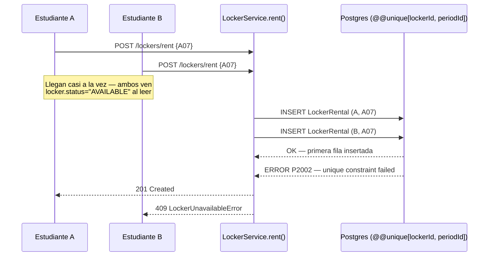
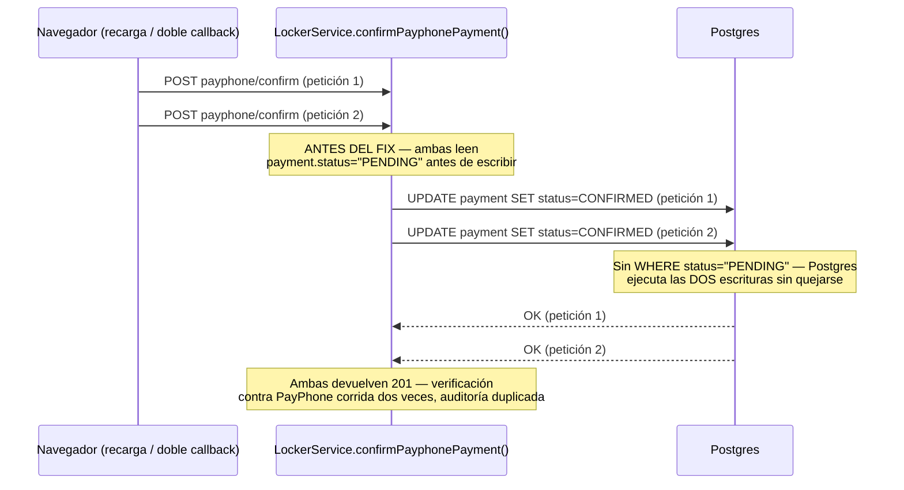
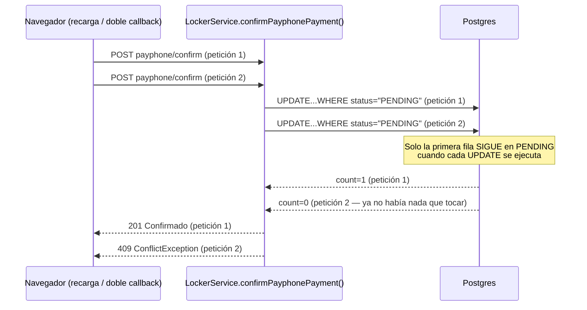
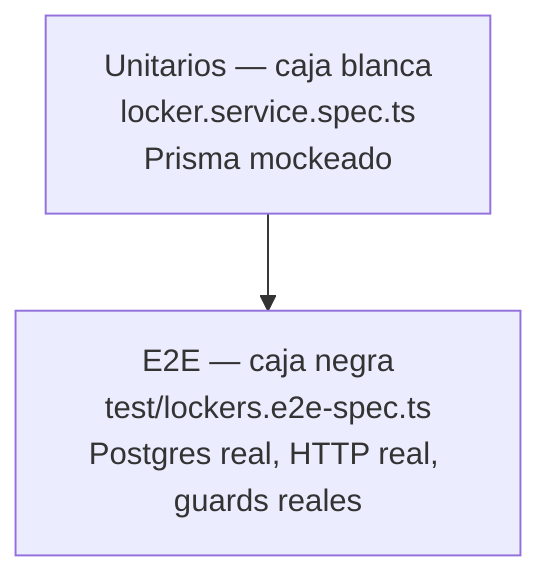

# 12 · Concurrencia y Estrategia de Testing (módulo de alquiler)

Responde a *"documenta los casos donde sí aplica concurrencia, y pruebas e2e y unitarias
caja negra/caja blanca a los nuevos módulos"*. Cubre el módulo de alquiler de casilleros
(`backend/src/locker/`) — el único de los módulos nuevos con verdadero riesgo de
concurrencia, porque es el único con una operación de "solo puede pasar una vez" (un
casillero, un alquiler) bajo tráfico de hasta 1.439 estudiantes potenciales.

## 1. Dónde SÍ aplica concurrencia — dos casos, no uno

### Caso 1 — dos estudiantes alquilando el mismo casillero a la vez

Es el caso obvio: 108 casilleros, potencialmente cientos de estudiantes mirando el mismo
mapa al abrir el periodo. Dos clicks casi simultáneos en el mismo casillero código A07 no
son un escenario raro, son el día de apertura del semestre.



**Por qué el chequeo de `locker.status` NO es la protección real:** `LockerService.rent()`
sí lee `locker.status` antes de insertar, pero esa lectura y el `INSERT` no son atómicos —
ambas peticiones pueden leer `"AVAILABLE"` en el mismo instante. La garantía real es la
restricción `@@unique([lockerId, periodId])` de `schema.prisma`: la base de datos rechaza
la segunda fila sin importar qué vio la aplicación. `onConflict` en
`money-mutation.helper.ts` traduce ese error de Postgres (`P2002`) a
`LockerUnavailableError` (409), no a un 500 genérico.

### Caso 2 — el mismo pago de PayPhone confirmado dos veces (bug real, ya corregido)

Este NO era obvio y se encontró auditando el código, no por un reporte de bug: el
navegador recargando la página de respuesta de PayPhone, o un doble callback real de la
pasarela, dispara dos peticiones a `confirmPayphonePayment()` para el **mismo**
`rentalId`/`subscriptionId` casi a la vez.

> Nota histórica: este mismo bug y el mismo fix se encontraron primero en
> `confirmReceipt()` (confirmación de comprobante de transferencia + OCR), cuando ese
> todavía era un método de pago disponible. Transferencia se retiró más adelante (PayPhone
> es el único método desde entonces — ver `rental-calculator.ts`), pero el patrón atómico
> de abajo sigue siendo exactamente el mismo, ahora aplicado a `confirmPayphonePayment()`.



**El fix** (`locker.service.ts`, `confirmPayphonePayment()`) cambia el `UPDATE` simple por
un `updateMany` con `WHERE id=paymentId AND status="PENDING"`, y revisa `count`:



Este patrón — `updateMany` + `WHERE` sobre el estado esperado + revisar `count`, en vez de
`findUnique` → chequear en memoria → `update` — es la forma correcta de hacer un
"check-then-act" atómico contra Postgres sin necesitar un lock explícito
(`SELECT ... FOR UPDATE`), que habría sido más lento y más código para el mismo resultado.

### Lo que NO es un caso de concurrencia aquí (para no confundir)

100 estudiantes *distintos* alquilando 100 casilleros *distintos* a la vez es carga
legítima, no una condición de carrera — cada petición toca una fila distinta, no hay nada
que coordinar. El rate limiting de `locker.controller.ts` (`@Throttle` 3 intentos/10s)
tampoco es la defensa aquí: existe para frenar a **un** actor abusando (bug de cliente o
script), no para resolver dos actores compitiendo por el mismo recurso — son dos problemas
distintos, con dos mecanismos distintos (ver `08-observabilidad-resiliencia.md` §1, mismo
razonamiento ya aplicado ahí).

## 2. Pirámide de testing aplicada a estos dos casos



**Por qué hacen falta los dos niveles, no solo uno:**

- Los **unitarios** (`locker.service.spec.ts`) prueban la *lógica* con Prisma mockeado —
  rápidos (segundos), aíslan el caso exacto (ej. "si `updateMany` devuelve `count=0`,
  lanza `ConflictException`"). Pero un mock de Prisma no tiene estado real: **no puede
  probar que la restricción `@@unique` de Postgres de verdad existe y de verdad
  funciona bajo carga concurrente real** — solo puede simular la respuesta que el
  desarrollador *cree* que Postgres daría.
- El **E2E** (`test/lockers.e2e-spec.ts`) dispara peticiones HTTP concurrentes reales
  (`Promise.all`, no en secuencia) contra la app NestJS completa corriendo sobre el
  Postgres real de `docker-compose.yml` — sin mockear Prisma en ningún punto. Es la única
  prueba que de verdad demuestra que el Caso 1 y el Caso 2 de arriba se resuelven
  correctamente contra la base de datos real, no solo contra la idea que el código tiene
  de cómo se comporta la base de datos.

### Qué se sustituye en el E2E, y por qué eso no lo vuelve "caja gris"

Dos cosas se reemplazan a propósito, ninguna toca lo que realmente se está probando:

| Se sustituye | Por qué | Lo que SÍ sigue siendo real |
|---|---|---|
| `JwtAuthGuard` | No hay forma de firmar un JWT real de Logto sin credenciales de un tenant (`10-despliegue-vps-vercel.md`) | `RolesGuard`, `@Public()`, y el propio guard de prueba respeta la misma jerarquía de roles que el real |
| `PayphoneClient` | No hay forma de completar el widget real de PayPhone (client-side, requiere un navegador de verdad) ni de pegarle a su API real de Confirm desde un test | La transacción de Prisma, el `updateMany` con `WHERE`, la restricción `@@unique` — todo eso es 100% real |

La integración real con PayPhone (token/storeId, formato exacto de su API de Confirm) se
verifica a mano contra el tenant real, no acá — repetirlo en el E2E solo agregaría una
dependencia de red externa a una suite que debe poder correr sin conexión a un tercero.

## 3. Cobertura por módulo nuevo

| Módulo | Caja blanca (unit) | Caja negra (e2e) |
|---|---|---|
| `locker.service.ts` (`rent`, `confirmPayphonePayment`, resolución de periodo) | ✅ `locker.service.spec.ts` — 23 casos, incluida la simulación de la carrera con mocks | ✅ `lockers.e2e-spec.ts` — 5 casos, incluidas las DOS carreras reales contra Postgres |
| `auth.controller.ts` → `GET /auth/me` | ✅ `auth.controller.spec.ts` — 2 casos nuevos | Cubierto indirectamente (el guard de prueba simula la identidad que este endpoint expone) |

Transferencia + comprobante por OCR (`confirmReceipt`, `OcrService`, `receipt-validator.ts`)
se retiró como método de pago — PayPhone es el único desde entonces. Esos archivos y sus
specs se borraron del repo; el único resto que queda es
`LockerService.releaseExpiredTransferReservations()`, un job que drena datos legacy de
ANTES del retiro (ver comentario en `locker.service.ts`), con su propia cobertura en
`locker.service.spec.ts`.

## 4. Cómo correr cada nivel

```bash
# Unitarios — rápidos, no necesitan nada corriendo aparte
cd backend && npm test

# E2E — necesita Postgres real corriendo (docker-compose.yml, puerto 5433)
# y backend/.env con DATABASE_URL apuntando a localhost:5433
cd backend && npm run test:e2e
```

**Detalle histórico del `test:e2e`:** corre con `cross-env NODE_OPTIONS=--experimental-vm-modules`
— se agregó porque `FileTypeValidator` (usa el paquete `file-type` vía import ESM dinámico
para detectar el tipo real de una imagen subida por magic-bytes) fallaba en silencio bajo
Jest sin ese flag. Con el retiro de transferencia + comprobante por OCR ya no queda ningún
endpoint que suba archivos (`FileTypeValidator` no se usa en ningún lugar del backend a día
de hoy), así que este flag ya no tiene nada que justificar su existencia — se deja anotado
acá en vez de quitarlo a ciegas, para que quien lo revise después decida con este contexto
si vale la pena confirmarlo y limpiarlo.

## 5. Cambio de código que esto forzó — `JwtAuthGuard`/`RolesGuard` ahora son providers propios

`auth.module.ts` registraba los guards **solo** dentro del multi-provider `APP_GUARD`
(`{ provide: APP_GUARD, useClass: JwtAuthGuard }`) — sin registrarlos también como su
propia clase inyectable, NestJS no expone ningún token contra el cual hacer
`overrideProvider(JwtAuthGuard)` en un test, y el override simplemente no hace nada (sin
error, sin aviso). El fix — registrar la clase como provider propio y usar
`useExisting` (no `useClass`, que crearía una segunda instancia distinta) en el binding de
`APP_GUARD` — es una corrección de testabilidad genuina, no un hack: la instancia que corre
como guard global ahora es la MISMA que la que un test puede reemplazar.
