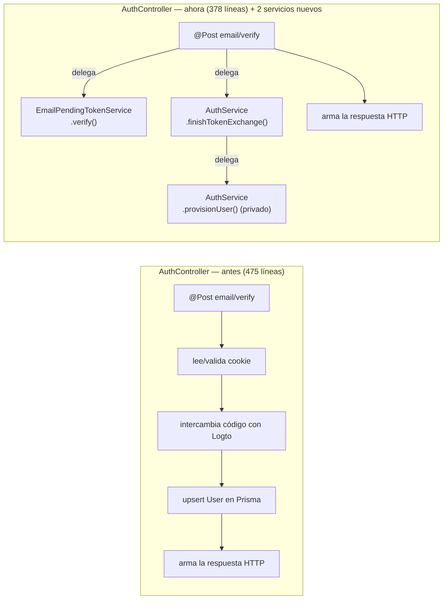

# 13 · Arquitectura del backend — módulos, capas y cuándo extraer un servicio

Responde a *"revisa esa arquitectura para no caer en un spaghetti, aplica un patrón de
software si es necesario, y documenta el backend"*. Es un mapa de cómo está organizado
`backend/src/` hoy, el patrón que ya sigue casi todo el código, el único punto donde no lo
seguía (`AuthController`, corregido en el mismo cambio que motivó esta revisión), y una
guía corta para decidir cuándo extraer algo nuevo sin caer en abstracción prematura.

## 1. Veredicto corto

**El backend está bien organizado.** Es un monolito modular de NestJS con un módulo por
dominio de negocio, y casi todos los controladores son delgados — reciben la petición
HTTP, la validan/adaptan, y delegan el trabajo real a un servicio inyectado. Eso es
exactamente el patrón que NestJS espera y el que este proyecto ya sigue por convención,
no por casualidad.

La única excepción real era `AuthController`: había crecido a 475 líneas mezclando manejo
de HTTP (OIDC, cookies, redirects) con lógica de dominio (intercambio de token,
aprovisionar el `User`, firmar/verificar estado) — por acumulación orgánica a lo largo de
varias iteraciones (login institucional → login social → login por correo → límite de
abuso), no por una decisión de diseño. Corregido en este mismo cambio (§3).

## 2. Estructura por módulo (un dominio, una carpeta)

```
backend/src/
├── locker/          — alquiler de casilleros (el módulo más grande y más crítico:
│                       ver 12-concurrencia-y-testing.md para su análisis de concurrencia)
├── subscription/     — niveles de aportación (Bronce/Platino/Pantera)
├── venture/          — directorio de emprendimientos estudiantiles
├── security/         — indicadores de seguridad del campus (solo lectura, sin escritura)
└── shared/
    ├── auth/          — login (OIDC social + correo con OTP), guards, JWT
    ├── prisma/        — el único punto de acceso a la base de datos
    ├── rate-limit/     — límites de abuso que no son por-IP (ver más abajo)
    ├── ocr/           — lectura de comprobantes de transferencia
    ├── period/         — periodo académico activo
    ├── audit/          — bitácora de auditoría
    ├── monitoring/      — salud de recursos (CPU/memoria) + alertas
    ├── health/          — endpoint de healthcheck para Docker/Caddy
    └── metrics/          — métricas Prometheus
```

Cada módulo de negocio (`locker`, `subscription`, `venture`, `auth`) sigue la misma forma:
un `*.module.ts` que junta un `*.controller.ts` (HTTP) con uno o más `*.service.ts`
(lógica). `shared/` son los módulos que varios dominios usan en común — ninguno depende de
`locker`/`subscription`/`venture` entre sí, solo de `shared/`.

## 3. El patrón: controlador delgado, servicio con la lógica



`LockerController` ya era el ejemplo de referencia de este patrón — cada método es 1-3
líneas, pura delegación:

```ts
// backend/src/locker/locker.controller.ts
@Post("rent")
rent(@Body() dto: RentLockerDto, @Req() req) {
  return this.lockerService.rent({ ...dto, userId: req.user.id });
}
```

`AuthController` no lo seguía todavía porque el login creció por partes: primero OIDC
(GitHub), después el login por correo con código de un solo uso, después el límite de
abuso por correo destino. Cada pieza se sumó donde ya estaba escribiendo, y el controlador
fue absorbiendo lógica que no depende de Express en absoluto. Se corrigió extrayendo:

- **`AuthService`** (`shared/auth/auth.service.ts`) — intercambio de código OIDC +
  aprovisionar el `User` en la base de datos. Mismo rol que `LockerService` para
  `/locker`: el controlador solo arma la petición y la respuesta HTTP, `AuthService` hace
  el trabajo real y no sabe qué es `Request`/`Response`.
- **`EmailPendingTokenService`** (`shared/auth/email-pending-token.service.ts`) — firma y
  verifica el estado pendiente del login por correo (ver
  [10-despliegue-vps-vercel.md] para el porqué de este diseño: el estado viaja explícito
  en el cuerpo JSON, no en una cookie, porque frontend y backend son dominios distintos).

Lo que se ganó al extraer, en concreto:

1. **Cada pieza se prueba sola.** `auth.service.spec.ts` y
   `email-pending-token.service.spec.ts` prueban la lógica sin levantar Express, cookies,
   ni el resto del controlador — más rápido y más preciso sobre qué se rompió si algo
   falla.
2. **Se encontró un bug real al extraer.** Al mover la firma del estado pendiente a su
   propio servicio, quedó a la vista que un token firmado sin más NUNCA vence — la cookie
   vieja vencía sola porque el navegador la borraba a los 10 minutos, pero un blob de
   datos JSON no tiene ese comportamiento gratis. `EmailPendingTokenService` le agrega una
   expiración explícita al payload, con su propio test que lo prueba
   (`email-pending-token.service.spec.ts`, caso "token ya vencido").
3. **`AuthController` volvió a tener el mismo tamaño/forma que el resto** — 378 líneas
   (bajó de 475), y el único método privado que le queda (`sanitizedEmailError`) es
   legítimamente de la capa HTTP: traduce un error interno de un proveedor externo a una
   respuesta segura, no es lógica de negocio.

## 4. Cuándo extraer un servicio nuevo (y cuándo NO)

Este proyecto ya rechaza la abstracción prematura en su propio estilo de código (ver los
comentarios "no abstracciones prematuras" repartidos por el repo) — extraer un servicio
por extraer sería ir contra esa misma convención. Los tres extraídos hoy pasaron un
criterio concreto, no "se veía más largo de lo que me gusta":

- **¿La lógica sigue teniendo sentido sin `Request`/`Response`?** Si un método no toca
  cookies, headers, ni códigos de estado HTTP, probablemente es lógica de dominio y
  pertenece a un servicio, no al controlador.
- **¿Vale la pena probarla aislada?** `finishTokenExchange` y la firma del estado
  pendiente tenían casos borde reales (correo ausente, usuario repetido, token alterado,
  token vencido) que ameritan su propio archivo de pruebas en vez de vivir enterrados
  entre pruebas de HTTP.
- **¿Un bug ahí se nota mejor estando aislado?** El bug de expiración faltante (arriba) es
  el ejemplo: viviendo como método privado del controlador, no había ningún lugar natural
  donde escribir "¿esto vence?" como pregunta aislada.

Lo que **no** amerita extracción todavía, aunque también es lógica de dominio dentro de un
controlador: `sanitizedEmailError` (15 líneas, una sola responsabilidad de traducir un
error, sin casos borde que valga la pena aislar) y cosas del mismo tamaño en otros
controladores. Tres líneas repetidas siguen siendo mejores que una abstracción que nadie
más va a usar — extraer solo cuando el criterio de arriba realmente aplica, no por
simetría con este documento.

## 5. Guards y autorización — global, no por-endpoint

`AuthModule` registra `JwtAuthGuard` y `RolesGuard` como `APP_GUARD` — todo endpoint nuevo
queda protegido por defecto (requiere JWT válido de Logto) sin que nadie tenga que
acordarse de agregar un decorador. Se abre explícitamente con `@Public()` donde de verdad
se necesita (login, callback, indicadores de seguridad sin PII) — nunca al revés. Las
reglas de `policy/semgrep-rules.yml` esperan encontrar exactamente este patrón en
cualquier controlador que mueva dinero.
